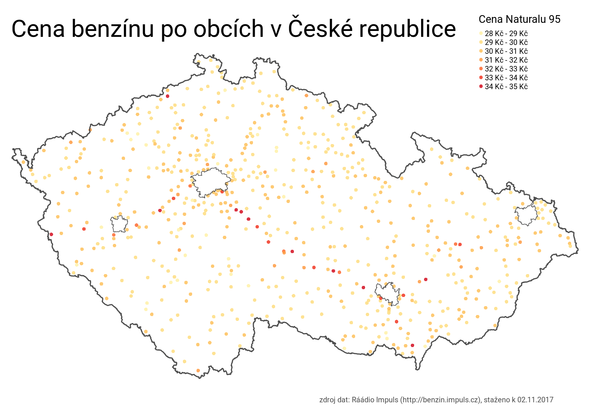

# CzechOil
Cenová mapa benzínu na čerpacích stanicích v ČR jako cvičení v R.

Cíl snažení:
- vyzkoušet práci s daty z webu (webscraping)
- potvrdit či vyvrátit hypotézu: nejdražší benzín v ČR je v Praze a na brněnské dálnici

  

Výsledek:  
- Praha je velká, pump je hodně, a ceny benzínu se rozředí. Žádná láce, ale také žádná tragédie.
- D1 je drahá jak sviň, ale Plzeňská D5 jí zdatně šlape na paty.  

QED :)
